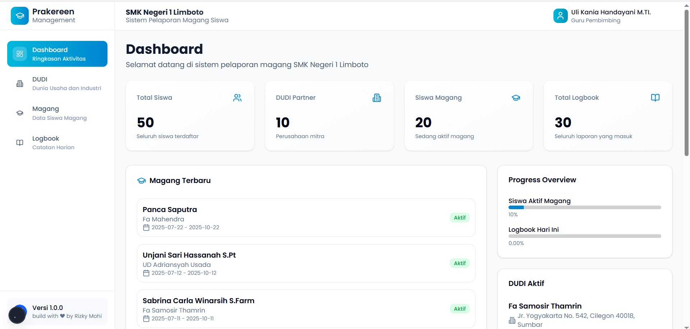
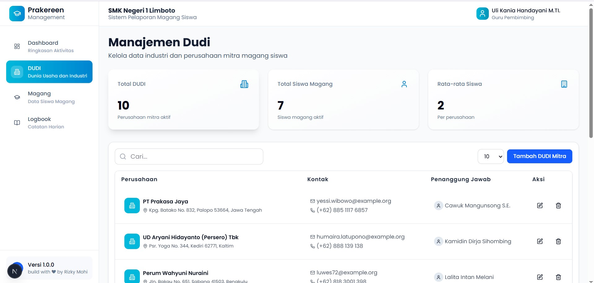

# 📘 Prakereen

**Prakereen** adalah aplikasi pencatatan magang siswa di **SMK Negeri 1 Limboto**.  
Aplikasi ini memudahkan guru pembimbing dan siswa dalam mengelola data magang, mulai dari pencatatan tempat magang (DUDI), status siswa, hingga laporan kegiatan.

---

## 🚀 Teknologi yang Digunakan
- **Backend**: [Laravel 12](https://laravel.com/)  
- **Frontend**: [Next.js](https://nextjs.org/)  
- **Database**: MySQL / MariaDB  

---

## ✨ Fitur Utama
- 📂 Manajemen data DUDI (Dunia Usaha & Dunia Industri)  
- 👩‍🎓👨‍🎓 Pencatatan data siswa magang  
- 📊 Monitoring status & progres magang siswa  
- 📝 Laporan magang terintegrasi  
- 🔐 Autentikasi pengguna (admin, guru, siswa)  

---

## 📦 Instalasi & Setup

### 1. Clone Repository
```bash
git clone https://github.com/Rizkymocin/prakereen.git
cd prakereen
```

### 2. Setup Backend (Laravel 12)
```bash
cd backend
composer install
cp .env.example .env
php artisan key:generate
php artisan migrate --seed
php artisan serve
```
Default backend berjalan di: http://localhost:8000

### 3. Setup Frontend (Next.js)
```bash
cd frontend
npm install
cp .env.example .env.local
npm run dev
```
Default frontend berjalan di: http://localhost:3000

### 🛠️ Struktur Proyek
```bash
prakereen/
├── backend/   # API dengan Laravel 12
└── frontend/  # Web app dengan Next.js
```

### 👨‍💻 Kontribusi
Kontribusi sangat terbuka!
Silakan fork repository ini, buat branch baru, lalu kirim pull request.

### 📄 Lisensi
Proyek ini dikembangkan untuk kebutuhan internal SMK Negeri 1 Limboto.

### 🙏 Kredit
Dikembangkan oleh Rizky Mohi dkk
SMK Negeri 1 Limboto, 2025

## 📸 Screenshot

Tampilan aplikasi **Prakereen**:

### Dashboard Guru


### Manajemen Data DUDI


### Laporan Magang Siswa

